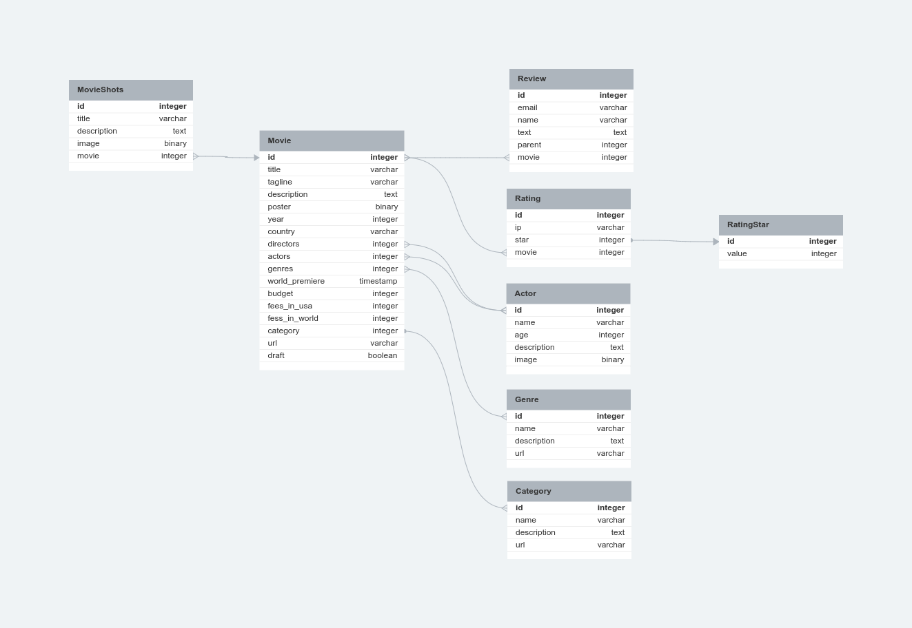

# Drf movies

[](https://github.com/kluevEVGA/api_final_yatube/blob/master/LICENSE)
[](https://python.org)
[](https://www.djangoproject.com/)
[](https://www.django-rest-framework.org/)


## О проекте

REST API backend сервис для movies.
Используется база данных postgreeSQL и django reset framework, подключена авторизация по JWT токенам.  
Выполнено рекурсивное отображение отзывов, а так же получение и сохранение ip отправителя отзыва.  
Копия базы данных в файле movies.postgres.bak.

## Установка

Клонировать проект

```shell
git clone https://github.com/kluevEVGA/Drf-movies.git
```

Установка окружения

```shell
python3 -m venv env
```

```shell
py -m venv venv
```

Активировать окружение

```shell
.\venv\Scripts\activate
```

```shell
source env/bin/activate
```

Установка зависимостей

```shell
pip install -r requirements.txt
```

## Запуск сервера

Перейти в папку с проектом

```shell
cd .\movie\
```

Выполнить миграции

```shell
python3 manage.py migrate
```

запустить сервер

```shell
py manage.py runserver
```

## End-points documentation

После установки сервера документация доступна по адресу:

```
swagger/
```

```
redoc/
```

## База Данных

1. Категории

```
1. имя - Char
2. описание - Text
3. url - Slug
```

2. Фильмы

```
1. название - Char
2. слоган - Char
3. описание - Text
4. постер - Image
5. год - Date
6. страна - Char
7. режиссер - M2M
8. актеры - M2M
9. жанр - M2M
10. премьера в мире - Char
11. бюджет - Char
12. сборы в США - Char
13. сборы в мире - Char
14. категория - FK 
15. url - Slug
16. черновик - Bool
```

3. Кадры из фильма

```
1. название - Char
2. описание - Text
3. изображение - Image
4. фильм - FK
```

4. Режиссеры\\Актеры

```
1. имя - Char
2. возраст - Int
3. описание - Text
4. изображение - Image
```

5. Звезды рейтинга

```
1. значение - Int
```

6. ейтинг

```
1. ip - IP
2. звезда - FK
3. фильм - FK
```

7. тзывы

```
1. email - Email
2. name - Char
3. text - Text
4. родитель (кому ответили)
5. фильм - FK

```

8. Жанры

```
1. имя - Char
2. описание - Text
3. url - Slug
```

## Схемма базы данных



## Лицензия

Распространяется по `MIT` лицензии. Для дополнительной информации
смотри: [LICENSE](https://github.com/kluevEVGA/Drf-movies/blob/master/LICENSE)
